# Task1 
- Collect disputes using a form. 
- Categorize disputes automatically using Ai-generated insights. 
- Assign priority levels based on customer history. 
- Notify support team wiht Ai-generated recommendations. 

## Approach Followed 
- Flask + SQLite are used for fast prototyping.
- A table 'disputes' is initialized using sqlite which has fields like : id, customer_id, transaction_id, dispute description etc. 
- The user submits their dispute using Flask generated form. 
<!-- <add T1/1 image> -->
<p float="left">
  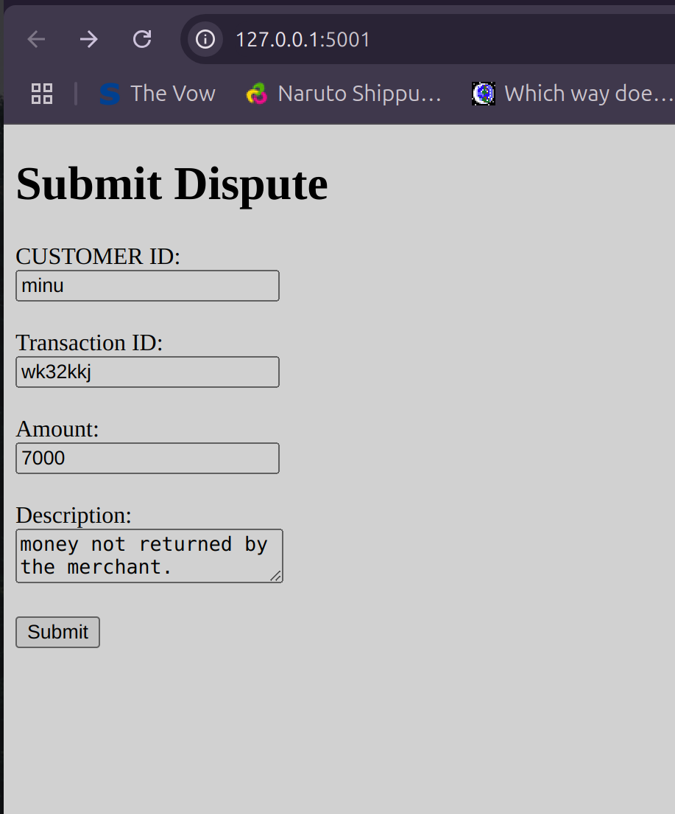
</p>
- The description is internally processed by AI to categorize the dispute into 3 categories. These 3 categories are the broad categories recognized.
    - (i) Fraud 
    - (ii) Merchant Error 
    - (iii) Friendly Fraud, 
- AI categorization and recommendations are integrated via Azure OpenAI API.
- Priority is decided by the amount registered. 
- The prompt is then passed to the model to get a recommendation on next steps. 
- All the above data is then added to the database. 
<!-- < add T1/2 image> -->
<p float="left">
  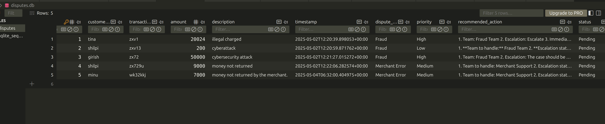
</p>
- The html required for the flask was generated by ai-model.
- This file can't be run since it requires api_key to run the ai_model which has been hosted on azure. 

# Task2 
- For self-service portal, a user wants to : check thier acccount balance. 
- Apply for a loan and receive Ai-generedated eligibility recommendations. 
- View their dispute history and track resolution. 

## Aproach Followed 
- Here we assume we've a basic sqlite database with customer information, which contains basic fields like id, customer_id, amount balance and pin as well as a disputes database which consists of all past disputes raised by the user. 
<!-- <add t2_1 png> -->
<p float="left">
  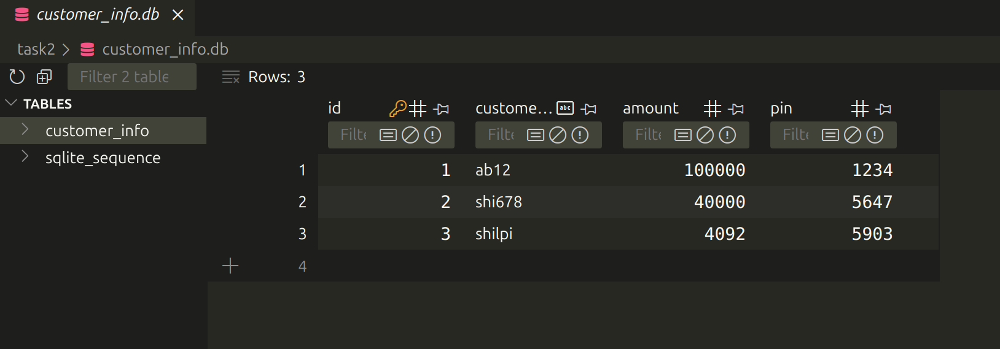
</p>
- User PINs are securely verified before allowing balance check or loan application.
- We've a Basic Flask page in the beginning which asks user the Customer_id and pin. Then it gives choice to select one of the three options : 
- (i) Check Balance. - In this case we just retrieve the infomation in the db and show it to user. 
<!-- add t2_2 png -->
<p float="left">
  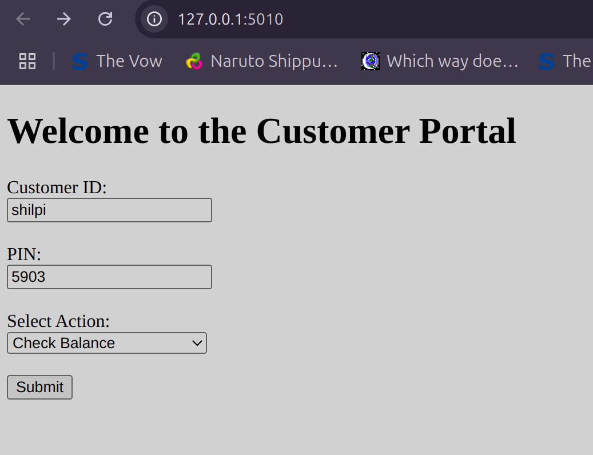
</p>
- (ii) Apply for Loan - If this option is selected, user sees some additional fields which must be filled out. After submission of this form, an AI generated output is shown. If the loan gets approved, it says Loan Approved. Otherwise it says: Not Approved. And then it also discusses the minimum eligibility criteria for the loan. 
- Loan eligibility uses AI logic to simulate a real recommendation system.
<!-- add t3 png 
add t4 png  -->
<p float="left">
  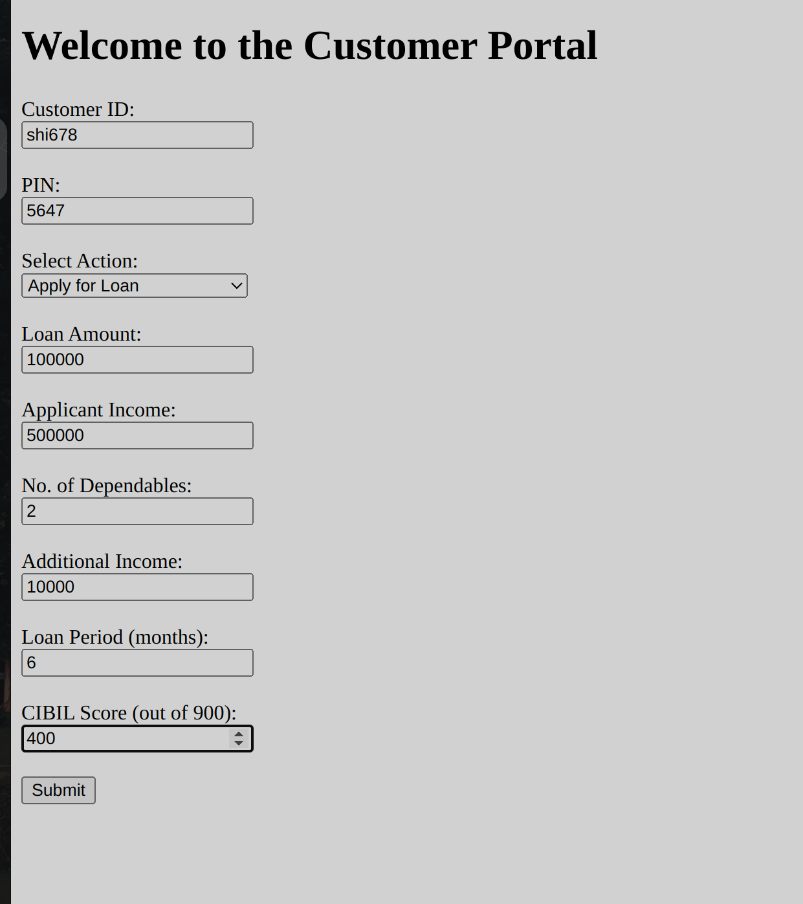
</p>
<p float="left">
  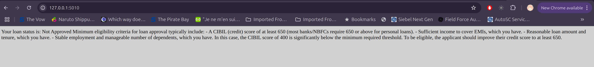
</p>
- (iii) In case if the user just wants to retrieve past disputes then the disputes sqlite database is referred to obtain and output the dispute as well as the status corresponding to it.
<!-- add t5, t6 , t7 -->
<p float="left">
  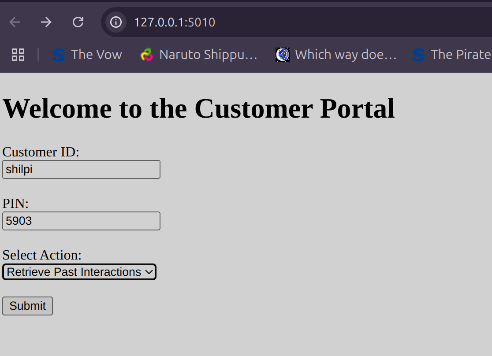
</p>
<p float="left">
  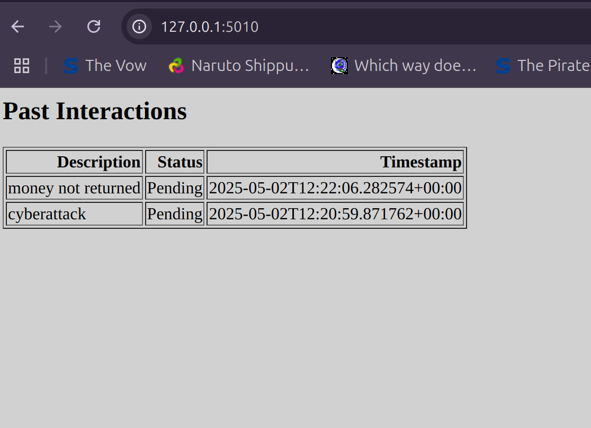
</p>
<p float="left">
  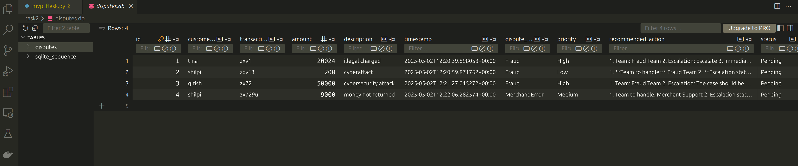
</p>
- All the html code was ai-generated. 
- Sqlite was chosen since it's easier to use. 
- Providing context to the ai model sped the whoole procedure. 
- This file can't be run since it requires api_key to run the ai_model which has been hosted on azure. 


# Task3 
- To have a backend which ensures high consistency,low latency, and resilience to feautres. 

## Approch Followed
- For this case I chose to go with MySQL rather than  sqlite since MySQL is used in production and is designed for high concurrent loads. Also , unlike sqlite, MySQL allows multiple writes to happen at the same time since it doesn't lock the whole file , but instead does row level locking. 
- A Mysql database was created and used. The MySQL database can be regenerated using the following commands : 
<!-- add code secction here  -->
```bash
sudo apt-get update
sudo apt-get install mysql-client

sudo systemctl status mysql

sudo systemctl start mysql

mysql -u root -p  # set password: your_root_password

# If the above command gives error:

sudo mysql

ALTER USER 'root'@'localhost' IDENTIFIED WITH mysql_native_password BY 'your_root_password';

FLUSH PRIVILEGES;

EXIT;

mysql -u root -p  # now enter your_root_password as value, and it should login

CREATE DATABASE bank_db;

mysql -u root -p bank_db < bank_db_dump.sql

mysql -u root -p

USE bank_db;

SELECT * FROM bank;

exit
```
- In case of error in a transaction, rollback occurs -> This ensures atomicity. This also ensures concistency in the case of a mid-crash transaction. 
- The following operations are supported under Debit card type: 
    - balance 
    - withdrawal 
    - cash transfer 
- These are the operations supported under Credit card type: 
    - check_balance
    - withdrawal, in this case a fine of 500 is also added. 

<!-- ### Steps to Run this:  -->
<p float="left">
  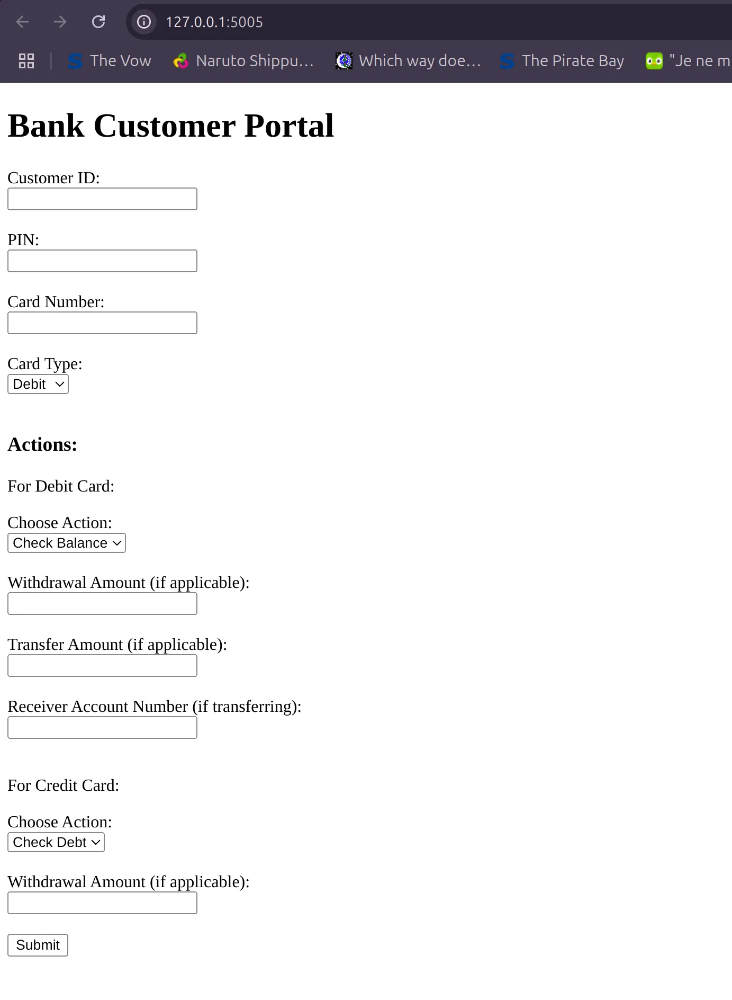
</p>

# Task4 
- Explain 2 Rate Limiting 
- One basic Rate Limiter 
    - Each user has 5 requests per second. 
    - Uses an efficient data structure for tracking request counts. 
- Discuss the tradeoffs between the 2 selected Rate Limiters. 

## Approach Followed. 
- In my case Im using a slidinwg window log approach where I count all the requests that come under the "window_size" time. Where window_size is the time for which we're limiting the requests. In my case window_size = 1. 
Then we count how many requests happened in this window, if this count exceeds we block the extra requests. 
    - Pro: Is very precise. 
    - Con : Needs to store all timestamps . Can grow large if many requests are there. 
- Second approach is Sliding Window Counter Approach . Here we count the number of requests that are coming in. Once the number reaches the max value, we block all further requests. 
    - Pro : Takes less in-memory space. 
    - Con : Is slightly less precise. 
- For tracking request counts, I'm using deque. which I import by doing collections.deque. 
    - It has O(1) time complexity for appending and popping items. 
    - It automatically drops old timestamps. 
    - Compared to a python list(which has O(n) for pops from the start), deque is much faster

<!-- add t4 1 image -->
<p float="left">
  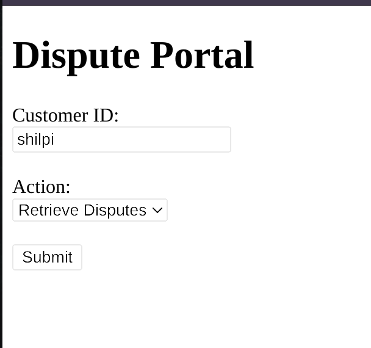
</p>